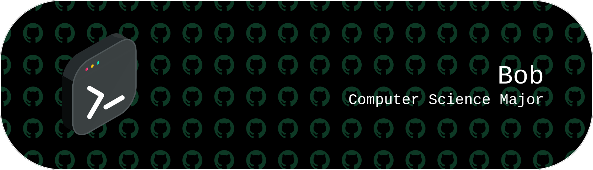

  

<h1 align="center">Hi 👋, I'm Bartosz</h1>

- 🎓 I'm a **Computer Science Major** at the Gdańsk university of technology (2nd year)
- 🌱 I’m currently working on [TypeRacer](https://github.com/ZambrzyckiBartosz/Type-Racer) and [Warehouse-Wars](https://github.com/ZambrzyckiBartosz/Warehouse-Wars)
- 👨‍💻 All of my projects are available at [https://github.com/ZambrzyckiBartosz](https://github.com/ZambrzyckiBartosz)
- 📫 You can reach me at: **zambrzyckibartosz709@gmail.com** or by discord [Discord](https://discord.com/users/298115748344102913)

### Socials:

### Languages and Tools:

  
  
  
  
  
  
  
  

